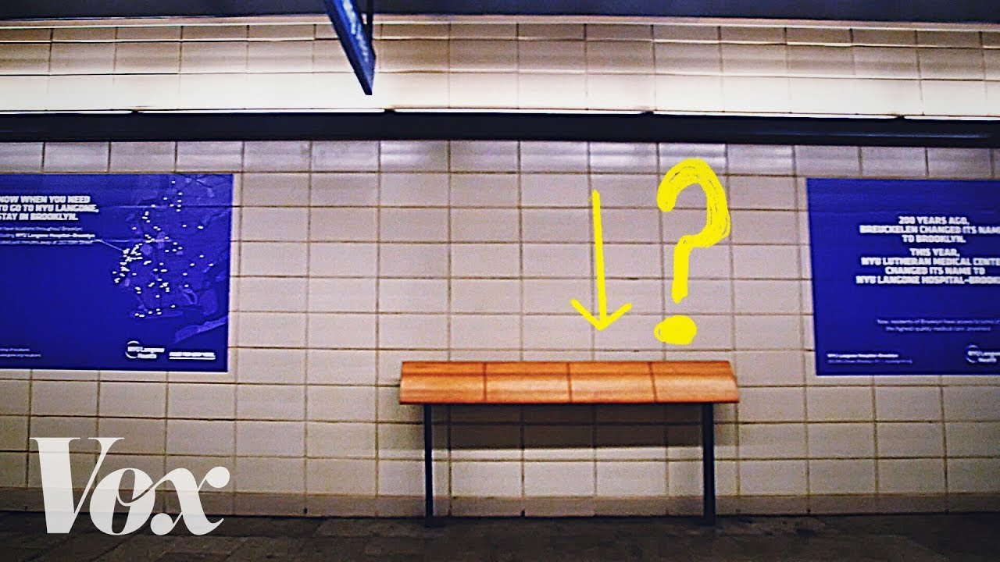
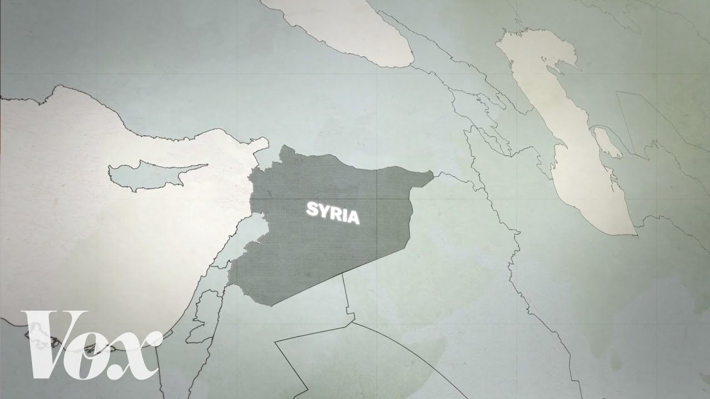

## About Me

:::: {.columns}

::: {.column width="65%"}

::: {.fragment}
- **Ph.D., Marketing** -- Mays Business School, Texas A&M University, 2022
:::

::: {.fragment}
- **Assistant Professor of Marketing** -- Kelley School of Business,
  Indiana University, Bloomington
:::

::: {.fragment}
- Two streams of research:
  - **Marketing and Society**
  - **B2B Marketing**
:::

::: {.fragment}
- The paper I am sharing today is from my Marketing and Society stream
:::

:::

::: {.column width="5%"}
:::

::: {.column width="30%"}

::: {.fragment fragment-index=1}
{style="max-height: 520px; border-radius: 10px; box-shadow: 0 4px 12px rgba(0,0,0,0.15);"}
:::

:::

::::

## Building on Dr. Sreenivasan's Talk

Dr. Sreenivasan gave you the **frameworks**:

- [**Clarity beats volume**]{.my-crimson} -- cognitive load theory
- [**Structure beats improvisation**]{.my-crimson} -- Minto Pyramid Principle
- [**Delivery beats design**]{.my-crimson}
- [**Audience beats speaker**]{.my-crimson}

. . .

I am going to show you what happens when you **violate** those
principles -- and what it looks like when you finally get them right.

## A Confession

- As PhD students, you are full of ideas. That is a good thing.

. . .

- But having great ideas is not enough. You have to tell a [**clear story**]{.my-crimson}.

. . .

- A paper is not a report of everything you did. A paper is a
  **story** -- with a beginning, a middle, and an end.

- If the story wanders, the reader gets lost. And a lost reviewer is a
  reviewer who says "no."

## The Early-Career Trap

You will be tempted to do **all of the following** in your early
projects:

. . .

- Study multiple outcome variables (*"the more, the better!"*)
- Run every analysis you can think of (*"let's show how thorough we
  are!"*)
- Include every interesting result (*"this is too cool to cut!"*)
- Avoid committing to one mechanism (*"what if we're wrong?"*)

. . .

::: {.crimson-glass style="max-width: 100%; margin-top: 20px;"}
**A paper that tries to say everything ends up saying nothing.**
Remember Dr. Sreenivasan's point: cognitive overload is real -- for
reviewers too.
:::

## Have You Watched Vox? {.smaller}

:::: {.columns}

::: {.column width="58%"}

How many of you have watched a Vox video?

::: {.fragment}
They take complex topics and make them intuitive. **11M+
subscribers.** Why? Exceptional storytelling.
:::

::: {.fragment}
Let me break down their formula.
:::

:::

::: {.column width="2%"}
:::

::: {.column width="40%"}

{width="200" style="margin-bottom: 8px;"}

{style="border-radius: 8px; box-shadow: 0 4px 12px rgba(0,0,0,0.15); margin-bottom: 6px; width: 100%; max-height: 170px; object-fit: cover;"}

{style="border-radius: 8px; box-shadow: 0 4px 12px rgba(0,0,0,0.15); width: 100%; max-height: 170px; object-fit: cover;"}

:::

::::

## The Vox Formula: 5 Moves

1. [**Open with the question, not the answer.**]{.my-crimson} They
   make you *want* to know before they tell you anything.

. . .

2. [**Build understanding layer by layer.**]{.my-crimson} Each piece
   earns its place by setting up the next.

. . .

3. [**One throughline, not many.**]{.my-crimson} One question per
   video. Everything else gets cut.

. . .

4. [**Explain the "why" early.**]{.my-crimson} Not just "this
   happened" but *why* it happened and *why you should care*.

. . .

5. [**Meet the audience where they are.**]{.my-crimson} Conversational,
   not academic. Clarity over cleverness.

## The Vox Formula Applied to Papers

| Vox | Your Paper |
|-----|-----------|
| Open with the question | Introduction makes the reader care *before* seeing results |
| Build layer by layer | Each section sets up the next -- lit review earns the hypothesis |
| One throughline | One research question, one story -- not three DVs in different directions |
| Explain the "why" early | Mechanism in the framework, not hand-waved in the discussion |
| Meet the audience | Write for a smart reviewer who is not in your exact subfield |

# [A Cautionary Tale]{style="color: #990000;"} {data-background-color="#FFFFFF"}

::: {style="color: #555; font-size: 1.1em;"}
What happens when the story is not clear -- from my own experience
:::

## The Paper

::: {.crimson-glass style="max-width: 100%; margin-top: 20px; text-align: center; font-size: 1.1em;"}
**How do fatal school shootings affect the economic activity of the
surrounding community?**
:::

. . .

Take a minute: how would **you** approach this? What **outcome
variables**, **identification strategy**, and **mechanism** would you
consider?

. . .

- **Data:** 69 incidents (2012-2019), NielsenIQ Homescan, Zillow

. . .

- **Method:** Difference-in-differences (treatment counties vs.
  matched neighbors)

. . .

- Good question. Rich data. Sound methods.

- [**Two reject-and-resubmits**]{.my-crimson} before we found the right journal -- where it got conditionally accepted after one round of revision.

## The Timeline

| Date | Event | Outcome |
|---|-------|---------|
| **Sep 2023** | 1st submission to Frontiers in Marketing Science | |
| **Oct 2023** | Decision | [Reject & Resubmit]{style="color: #990000; font-weight: bold;"} |
| **Mar 2024** | 2nd submission to Frontiers in Marketing Science | |
| **Mid 2024** | Decision | [Reject & Resubmit]{style="color: #990000; font-weight: bold;"} |
| **Jul 2024** | Submitted to JMR | [Smoother]{style="color: #2D6A4F; font-weight: bold;"} |

. . .

> Editor: *"It is very unusual for the same paper to receive a reject
> and resubmit twice in a row."*

# [Where the Story Went Wrong]{style="color: #990000;"} {data-background-color="#FFFFFF"}

::: {style="color: #555; font-size: 1.1em;"}
Three mistakes that kept the story from working
:::

## Mistake #1: We Tried to Say Too Much

Version 1 studied **three** outcome variables: grocery purchases, vice
goods (alcohol + cigarettes), and home values

. . .

We thought: more outcomes = more comprehensive = more impressive

## Version 1: The Results Were All Over the Place

- **Groceries:** ~1% decline, but only in *liberal*-leaning counties
- **Vice goods:** No change in alcohol, but 13% drop in cigarettes --
  only in *conservative*-leaning counties
- **Home values:** 6.5% decline -- only in *conservative*-leaning
  counties

. . .

[Every result pointed in a different direction for a different subgroup.]{.my-crimson}

We also checked two health indices for diet quality -- no significant
effects. We were reporting a *collection of findings*, not a *story*.

## Too Many Outcomes: What the Reviewers Thought

> **R1:** *"Findings have no theoretical grounding. Some effects in
> conservative counties, some in liberal, no explanation for why"*

> **R2:** *"My main concern surrounds the 'Why?'"*

. . .

::: {.crimson-glass style="max-width: 100%; margin-top: 20px;"}
**Three plots, no throughline.** We did not know where we were going --
so neither could the reviewers.
:::

## Mistake #2: "What" Without "Why"

This is exactly the **framing failure** Dr. Sreenivasan described --
we showed what we studied but failed to articulate why it matters.

. . .

> **AE:** *"Without a context for why we might expect these effects...
> it is harder to contextualize"*

> **R1:** *"Is this because people are eating less? Eating less at
> home?"*

. . .

::: {.crimson-glass style="max-width: 100%; margin-top: 20px;"}
**A finding without a mechanism is a fact, not a story.**
:::

## Round 2: Tighter, But Still No "Why"

We dropped vice goods. Improved identification. Added a consolidation
story.

- **Groceries:** 1.35% decline overall (not just liberal counties)
- **Consolidation:** Fewer stores, fewer categories, fewer new products
- **Home values:** 3.2% decline (down from 6.5% after better
  estimation)

. . .

But still [**no direct evidence**]{.my-crimson} for *why* the effect happened.

## Round 2: Same Question Again

> **AE:** *"50 cents per household per week is small... we'd have to
> worry about economic significance"*

> Editor: [*"Seriously consider sending the paper to another
> journal"*]{style="color: #990000; font-weight: bold;"}

. . .

::: {.crimson-glass style="max-width: 100%; margin-top: 20px;"}
**Same question, two rounds. The problem was our communication.**
:::

# [The Turning Point]{style="color: #990000;"} {data-background-color="#FFFFFF"}

::: {style="color: #555; font-size: 1.2em;"}
What changed for JMR
:::

## We Found the Story

We asked: [**What is the *one* story this paper tells?**]{.my-crimson}

. . .

1. [**Narrowed scope:**]{.my-crimson} One outcome (groceries), not
   three
2. [**Built a framework:**]{.my-crimson} Anxiety as the mechanism
3. [**Added three experiments**]{.my-crimson} to directly test the
   "why"
4. [**Grounded the ideology story**]{.my-crimson} in motivated social
   cognition

## Version 3: Every Result Served the Story

- **Groceries:** 1.35% decline overall, **2.62%** in liberal counties
- **Consolidation with a reason:** Shopping days down 0.85%, stores
  down 0.93%, categories down 1.05% -- *avoidance of public spaces*
- **Sugar and added sugar also declined** -- ruling out comfort eating

. . .

- **Study 2:** Text analysis confirmed *anxiety* (not sadness, not
  mortality salience)
- **Study 3:** Self-reported anxiety mediated the effect
- **Study 4:** Moderated mediation by political ideology

. . .

Now every finding pointed in the same direction. [**One story.**]{.my-crimson}

## Before and After

:::: {.columns}

::: {.column width="48%"}

::: {style="background-color: #FDEDED; padding: 20px; border-radius: 10px; border-left: 5px solid #990000;"}

**BEFORE**

*"Groceries decline, vice goods change, home values fall. Might be
anxiety or coping. Not sure. Effects differ by politics. Not sure
why."*

Three plots. No throughline.

:::

:::

::: {.column width="4%"}
:::

::: {.column width="48%"}

::: {style="background-color: #E8F5E9; padding: 20px; border-radius: 10px; border-left: 5px solid #2D6A4F;"}

**AFTER**

*"School shootings trigger anxiety about public safety, reducing
grocery shopping. Stronger for liberals due to how they attribute gun
violence."*

One story. Clear throughline.

:::

:::

::::

## The Structure Told the Story

| Study | Role | What It Does |
|-------|------|--------------|
| **Study 1** | *The effect* | Empirical: grocery purchases decline, consolidation |
| **Study 2** | *The "why"* | Experiment: anxiety via text analysis |
| **Study 3** | *Confirm* | Experiment: self-reported anxiety |
| **Study 4** | *"For whom"* | Experiment: moderated mediation by ideology |

. . .

Each study = a chapter. [Each chapter advances the plot.]{.my-crimson}

## The Numbers

|  | MktSci 1st | MktSci 2nd | JMR |
|--|:----------:|:----------:|:---:|
| **Outcomes** | 3 | 2 | 1 |
| **Mechanism** | None | Weak | Clear |
| **Experiments** | 0 | 0 | 3 |
| **Result** | [R&R]{style="color: #990000;"} | [R&R]{style="color: #990000;"} | [Smoother]{style="color: #2D6A4F;"} |

. . .

::: {.crimson-glass style="max-width: 100%; margin-top: 30px; text-align: center; font-size: 1.1em;"}
**Fewer outcomes. Clearer mechanism. Better story. Better result.**
:::

## And the Story Continues...

- This paper is now a **finalist** for the **Paul Green/Vithala Rao Award** for best paper published in the *Journal of Marketing Research*.

. . .

- The ideas were always good. The data was always rich. What changed was the [**story**]{.my-crimson}.

. . .

- We discussed the full journey on JMR's ***How I Wrote This*** podcast (Ep. 23). Listen if you are interested -- not just this episode, the entire series is a great resource.

. . .

::: {style="text-align: center; margin-top: 5px;"}
{width="10%"}

[*How I Wrote This* -- Ep. 23]{style="font-size: 0.6em; color: #888;"}
:::

# [Takeaways]{style="color: #990000;"} {data-background-color="#FFFFFF"}

::: {style="color: #555; font-size: 1.1em;"}
What I wish someone had told me
:::

## Five Things I Wish I Knew

1. **One question, one story.** If you need more than two sentences to
   explain your paper, the story is not clear.

. . .

2. **Cutting is sharpening.** Dropping content makes papers stronger,
   not weaker. **Clarity beats volume.**

. . .

3. **The "why" is not optional.** A finding without a mechanism does
   not get published.

. . .

4. **Listen to repeated feedback.** If two people ask the same
   question, it is your communication, not their comprehension.
   **Audience beats speaker.**

. . .

5. **Structure is communication.** Every section should advance the
   plot. **Structure beats improvisation.**

## One Last Thing

When a paper struggles -- and it will -- ask yourself:

- **Is my story clear?**
- **Am I trying to say too much?**
- **Have I explained the "why"?**

. . .

::: {.crimson-glass style="max-width: 100%; margin-top: 20px; text-align: center; font-size: 1.1em;"}
**A good idea poorly communicated is a missed opportunity. Do not let
your ideas down by not telling their story well.**
:::

# {data-menu-title="Thank You" data-background-color="#FFFFFF" style="text-align: center;"}

::: {style="margin-top: 60px;"}

<h1 style="font-size: 3em; color: #990000;">
Thank You!
</h1>

Writing a paper is telling a story. Tell yours well.

Muzeeb Shaik

shaikmu@iu.edu

Gig 'Em Aggies!

:::
